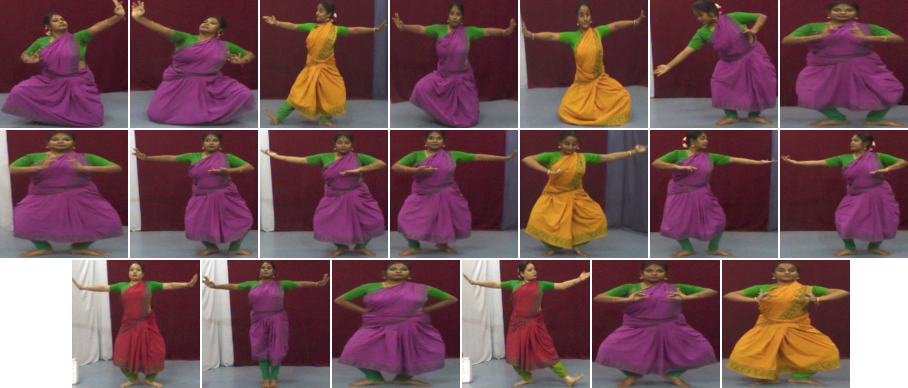

## Setup

pip install -r requirements.txt

python train.py

## 🖼️ Results

### Generated Samples


If you find our code useful for your research, please cite our paper
```
@inproceedings{kamble2025bharatanatyam,
 title={Generating Key Postures of Bharatanatyam Adavus with Pose Estimation},
  author={Kamble, Jagadish and Mukhopadhyay, Jayanta and Roy, Debaditya and Das, Partha Pratim},
  booktitle={Proceedings of the Indian Conference on Computer Vision, Graphics and Image Processing (ICVGIP)},
  year={2025}
}
```
